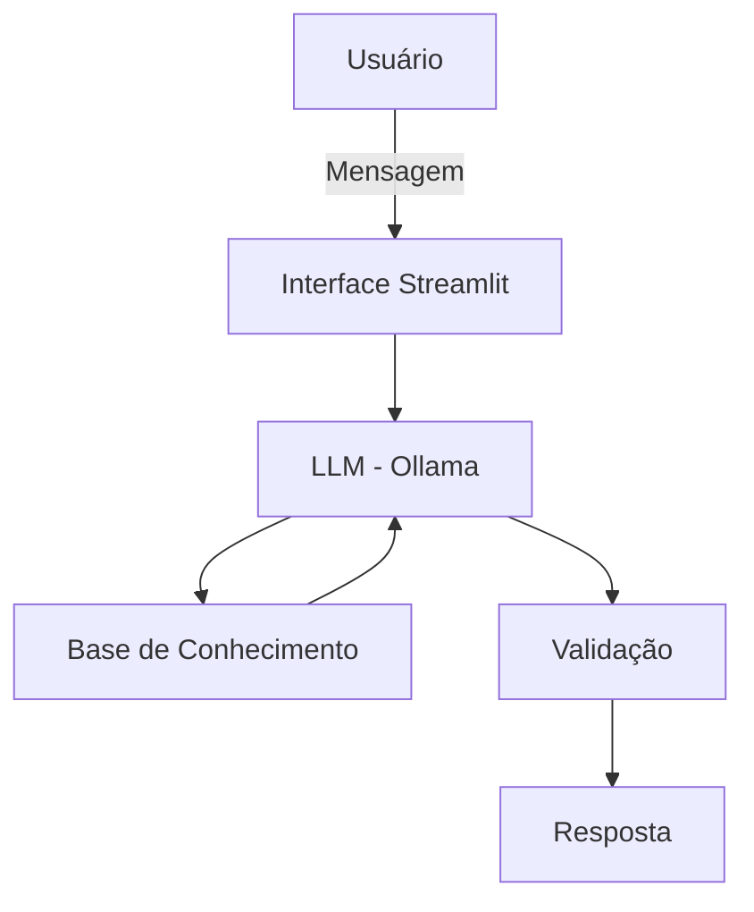

# 💵 ECO — Economia, Controle e Organização

Agente financeiro conversacional que ajuda a organizar gastos, acompanhar metas e entender padrões de consumo com base nos próprios dados do usuário — sem dar ordens, sem inventar informação e sem recomendar produtos financeiros específicos.

Projeto desenvolvido como parte do desafio **Agente Financeiro Inteligente com IA Generativa** (DIO), adaptado com persona, regras, base de dados e casos de teste próprios.

---

## Sobre o ECO

O ECO nasceu de um problema simples: muita gente tem dificuldade em controlar, organizar e acompanhar os próprios gastos. Em vez de ser mais uma planilha ou um app de metas genérico, o ECO conversa com o usuário, analisa as transações reais dele e sugere caminhos — sempre como sugestão, nunca como ordem.

**Principais características:**
- Linguagem informal, acessível e didática
- Nunca dá ordens diretas — só sugestões
- Admite quando não sabe algo, em vez de inventar
- Não recomenda produtos, marcas ou corretoras específicas (nem tradicionais, nem cripto)
- Reconhece quando o usuário pergunta sobre algo que não existe na base, em vez de associar ao registro mais parecido

Essas regras existem porque, durante os testes, o agente cometeu exatamente os erros que elas previnem — o processo de construção está documentado em [`docs/03-prompts.md`](./docs/03-prompts.md).

---

## Estrutura do Projeto

```
📁 eco-agente-financeiro/
│
├── 📄 README.md                       # Este arquivo
│
├── 📁 data/                           # Dados mockados do usuário
│   ├── perfil_usuario.json            # Perfil, renda, metas e preferências
│   ├── transacoes.csv                 # Histórico de transações
│   └── historico_interacoes.csv       # Histórico de atendimentos anteriores
│
├── 📁 docs/                           # Documentação do agente
│   ├── 01-documentacao-agente.md      # Caso de uso, persona, arquitetura e segurança
│   ├── 02-base-conhecimento.md        # Estratégia de dados e integração
│   ├── 03-prompts.md                  # System prompt, few-shots e edge cases
│   ├── 04-metricas.md                 # Cenários de teste e resultados
│
└── 📁 src/                            # Código da aplicação
    ├── app.py                         # Interface Streamlit + integração com Ollama
    └── README.md                      # Passo a passo para rodar localmente
```

---

## Como Funciona



O `system prompt` que define o comportamento do ECO **não está fixo no código** — ele é lido diretamente do arquivo [`docs/03-prompts.md`](./docs/03-prompts.md) em tempo de execução. Isso significa que a documentação é a única fonte de verdade: qualquer ajuste de regra, tom ou exemplo feito no `.md` já reflete no agente, sem precisar duplicar o texto no `app.py`.

Mais detalhes de arquitetura, persona e estratégias anti-alucinação estão em [`docs/01-documentacao-agente.md`](./docs/01-documentacao-agente.md) e [`docs/02-base-conhecimento.md`](./docs/02-base-conhecimento.md).

---

## Como Rodar

```bash
# 1. Instalar o Ollama (ollama.com) e baixar o modelo
ollama pull gpt-oss

# 2. Instalar dependências
pip install streamlit pandas requests

# 3. Garantir que o Ollama está rodando
ollama serve

# 4. Rodar o app (a partir da raiz do projeto)
streamlit run src/app.py
```

Instruções detalhadas em [`src/README.md`](./src/README.md).

---

## Testes e Aprendizados

O agente foi testado manualmente com perguntas reais contra os dados mockados, cobrindo desde análises simples de gastos até tentativas propositais de gerar erro (ex: perguntar sobre um item inexistente, pedir recomendação de investimento específico, ou sair do tema de finanças). Os resultados, incluindo falhas encontradas e como foram corrigidas, estão documentados em [`docs/04-metricas.md`](./docs/04-metricas.md) e no final de [`docs/03-prompts.md`](./docs/03-prompts.md).

Alguns achados relevantes:
- O modelo local (Ollama) confunde termos parecidos na base (ex: "roupa" vs. "guarda-roupa") se não houver regra e exemplo explícitos contra isso.
- Aritmética feita pelo próprio LLM não é confiável — é um ponto de atenção para uma camada de validação futura.
- Recomendação de produtos financeiros precisa cobrir também criptoativos e ferramentas (wallets), não só investimentos tradicionais.
